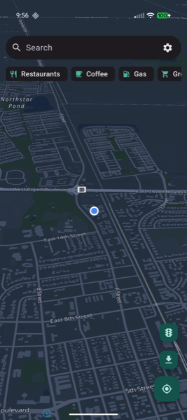
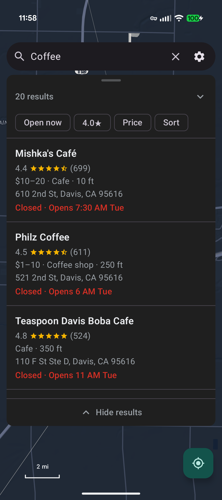
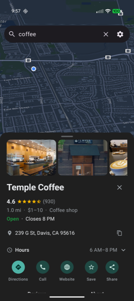
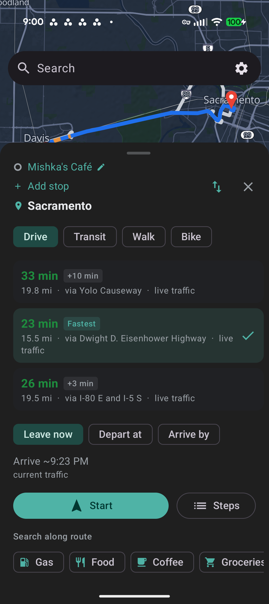
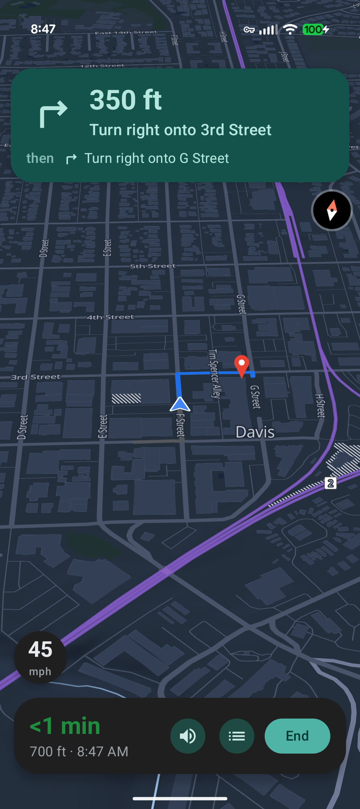
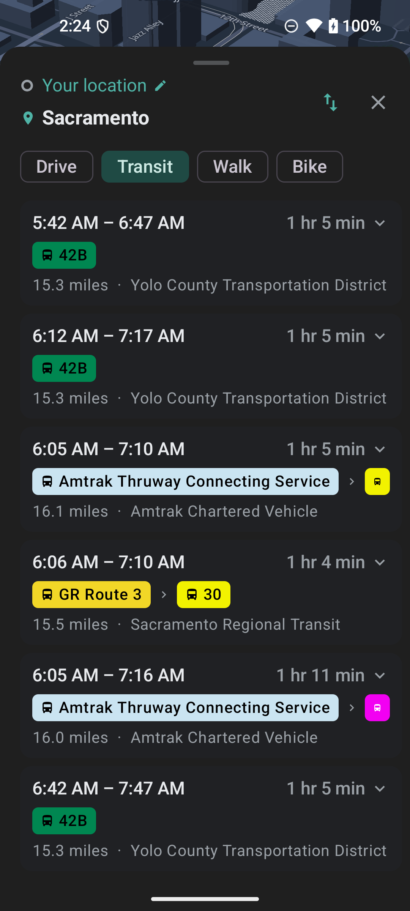
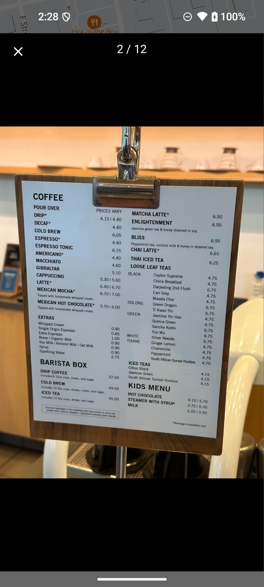
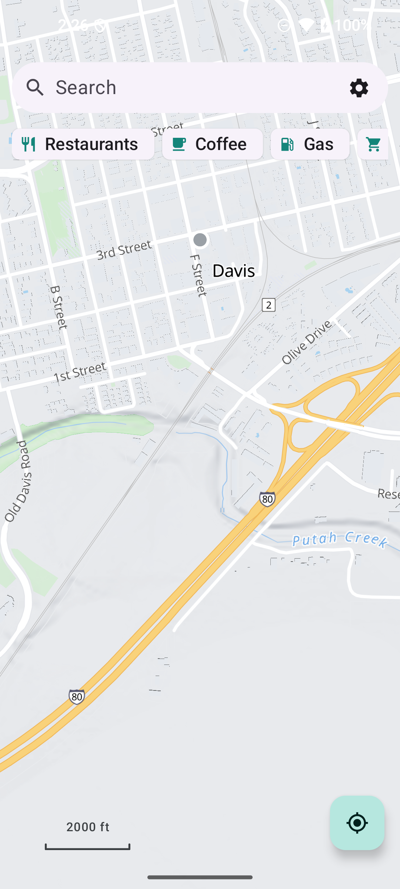
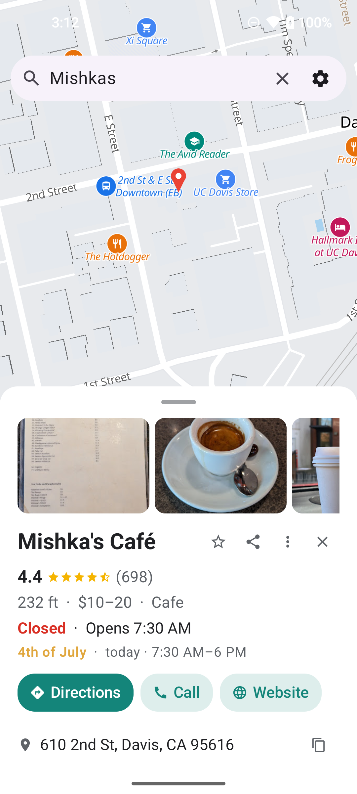

# Vela Maps (D-pad edition)

> This project began as a fork of [Vela Maps](https://github.com/PimpinPumpkin/Vela) by
> PimpinPumpkin. It adds full 5-key D-pad and feature-phone operability on top of their
> work, and still depends on the upstream project for some hosted functionality: the
> routing-graph, map-overlay and place-pack release assets, and the signed calibration
> config channel. All credit and thanks to the original project.

A degoogled maps and navigation client for Android. Runs on GrapheneOS and other no-GMS ROMs.

## Phone status

**All testing is SIMULATED** - the screen size is set with `wm size`/`wm density` on a test device;
**nothing has run on the actual phones**. Because the targets collapse to two screen sizes, that is
what's tested (each phone with that size shares the result):

| Simulated size | Target phones | Coverage (screenshots in [`tests/devices/`](tests/devices/)) |
|---|---|---|
| 240x320 | Kyocera e4810, TCL Flip 2, Sonim XP3 (XP3800), Kyocera DuraXV | **FULLY COVERED (16/16)** - first-run (Welcome + voice/offline/consent dialogs), bare map, search overlay, results, place sheet (+ expanded), directions, route steps, and Settings incl. the deep Voice-library / Offline / Saved-places sub-sections ([`kyocera-e4810/screenshots/full/`](tests/devices/kyocera-e4810/screenshots/full/)) |
| 480x854 | Sonim X320 (XP3 Plus 5G) | **FULLY COVERED (16/16)** - same 16-surface tour at the device's real resolution ([`sonim-x320/screenshots/full/`](tests/devices/sonim-x320/screenshots/full/)) |

Both sizes pass the full-coverage gate: `bash tests/devices/full_coverage.sh <device-id>` drives every
surface at the device's geometry and prints **RESULT: FULLY COVERED (0 MISSED)** - the hard requirement
for calling a device supported (see [`AGENTS.md`](AGENTS.md)). NOT yet in the gate: live turn-by-turn
navigation cards and transit itineraries. **Real-hardware confirmation: none** - the geometry is
simulated with `wm size`/`wm density`, so this is "fits and is D-pad-navigable at these simulated
sizes," not "run on the actual phones." New models drop straight into the matrix - open an issue with
the model + screen size and resolution.

- **D-pad first.** Fully operable with a 5-key D-pad (arrows + OK) and hardware BACK on a
  device with **no touchscreen**. Touch is a bonus.
- **Tiny screens.** Fits real feature-phone displays (240x320-class): the app checks its screen and
  scales its own density so nothing clips. Verified per-device with screenshots in [`tests/devices/`](tests/devices/).
- **Degoogled.** No Google Play Services, no account, no API key, no backend.
- **NewPipe's model, for Google Maps.** Open vector tiles for the basemap; the phone scrapes
  Google's public web endpoints per-user for POIs, routing, and traffic-aware ETAs.

## Install

[](https://apps.obtainium.imranr.dev/redirect?r=obtainium://add/https://github.com/alltechdev/vela-dpad)

Add `https://github.com/alltechdev/vela-dpad` in
**[Obtainium](https://github.com/ImranR98/Obtainium)** to auto-track the latest
release, or grab an APK from
[Releases](https://github.com/alltechdev/vela-dpad/releases). No Play Store, no account.

## Screenshots

| Map & search | Search results | Place details | Directions | Navigation |
|:-:|:-:|:-:|:-:|:-:|
|  |  |  |  |  |

| Public transit | Photo gallery | Light theme, search | Light theme, place |
|:-:|:-:|:-:|:-:|
|  |  |  |  |

## How it works

What Vela does and the method behind each capability. The full feature list is in
[`FEATURES.md`](docs/FEATURES.md), the deeper contract in [`SPEC.md`](docs/SPEC.md), and
planned work in [`ROADMAP.md`](docs/ROADMAP.md).

| Capability | Method | Start here |
|---|---|---|
| **D-pad-only operation** | The whole UI runs on a 5-key D-pad: arrows pan the map, OK-at-crosshair taps, hold-OK drops a pin, on-screen zoom, focus rings, a key path for every gesture. Fits tiny feature-phone screens via `AdaptiveDensity` (scales the app's density to the panel) | [`docs/dpad.md`](docs/dpad.md), `app/ui/DpadFocus.kt`, `app/ui/map/MapDpadController.kt`, `app/ui/AdaptiveDensity.kt`, [`tests/devices/`](tests/devices/) |
| **Basemap** | Open vector tiles (OpenFreeMap / Protomaps) via MapLibre, keyless, recoloured Google-style at runtime | `core/data/tiles/`, `app/ui/map/VelaMapView.kt` |
| **Search, places, reviews, hours** | Per-user keyless scrape of `google.com` `pb` endpoints; positional arrays walked by calibrated index paths | `core/data/google/`, SPEC section 3 |
| **Photos / transit / popular-times** | Hidden anonymous WebView reads what the bare RPC is bot-degraded out of | `app/web/` |
| **Turn-by-turn routing** | FOSSGIS OSRM (open), complete street-named steps incl. highway refs / exits / lanes | `core/data/RouteGeometry.kt` |
| **Traffic ETA + jam reroute** | Google's directions overlaid on the OSRM route; re-runs OSRM through Google's path only when they diverge | `GoogleMapsDataSource.directions` |
| **Offline routing + geocoding** | On-device GraphHopper graphs + SQLite POI/address stores + whole-region place packs, downloaded per region | `core/data/GraphHopperRouteEngine.kt`, `app/offline/` |
| **Open map overlays** | Microsoft building footprints + OpenAddresses house numbers as per-region PMTiles, streamed beneath OSM | `app/offline/OverlayTileStore.kt` |
| **Navigation** | Pure `NavEngine` turn logic (unit-tested) into a maneuver banner (lanes / shields), AOSP TTS + a bundled neural voice, haptics | `core/nav/`, `app/ui/nav/`, `core/voice/` |
| **Location** | AOSP `LocationManager` + rotation-vector sensor, never GMS / Fused | `core/location/` |
| **Fix drift without an app update** | ECDSA-signed remote `calibration.json` verified against a pinned key | `core/config/CalibrationStore.kt`, SPEC section 5 |
| **Diagnostics** | Local crash / ANR / jank capture (Timber, CrashCatcher, ExitInfoReader, StrictMode), shown in Settings -> Diagnostics | `app/diag/` |

## Why it scrapes Google

- **The gap.** A phone without Play Services cannot run Google Maps, and open datasets fall
  short on search, reviews, hours, and live traffic.
- **The approach.** Vela is a thin client that asks Google's public endpoints the way a
  logged-out browser does: from your own IP, no shared key, no server in between (NewPipe's
  legal footing).
- **What Google sees.** Your IP, query, and map area. Not a Google account, not an app key.
- **Open where it can.** The basemap is open vector tiles and streets come from OpenStreetMap,
  so the heaviest load never touches Google and offline detail follows OSM coverage.
- **No backend, no account, no telemetry.** Saved places, history, and settings never leave
  the device. Full per-endpoint breakdown in [`PRIVACY.md`](docs/PRIVACY.md).

> **Never embed a static Google API key.** That turns "a user scraped from their own IP"
> (defensible, NewPipe's footing) into "the app shipped Google's credential" (not). The
> per-user `GoogleSession` bootstrap is the whole point.

## Architecture

Two Gradle modules (AGP 8.7.3, Kotlin 2.1, Compose, Hilt, R8):

- **`:core`** is the UI-agnostic extractor (NewPipeExtractor pattern): the model, the
  `MapDataSource` seam (a Mock source plus the Google scraper), OSRM + GraphHopper
  routing, offline stores, location, voice, haptics, the nav engine, and calibration.
- **`:app`** is the Jetpack Compose (Material 3) UI: map, search, place sheet,
  directions, the navigation banner, settings, the hidden-WebView scrapers, and offline
  downloads.

`MapDataSource` is the seam: Mock today, Google once calibrated, a future Overture/OSM
or self-hosted source drops in the same way. Full module tree in [`AGENTS.md`](AGENTS.md).

## Build & run

```bash
# debug: R8-minified AND debuggable, smooth on-device, installs beside release (app.vela.debug)
./gradlew :app:assembleDebug

# distribution build: R8 + resource shrinking
./gradlew :app:assembleRelease

# unit tests for the pure logic (polyline codec, nav engine)
./gradlew :core:test
```

- Both build types run R8; the debug build stays debuggable and installs beside release.
- Every push to `main` publishes a signed `v0.0.<run>` release with both APKs, tracked by
  Obtainium and the in-app updater.
- Out of the box the app uses the live Google source over the keyless OpenFreeMap basemap;
  `MockMapDataSource` is the offline fallback, and reverse-geocode uses OpenStreetMap Nominatim.

See [`AGENTS.md`](AGENTS.md) for the build variants, signing secrets, the dead-code CI gate,
and the `MAPTILER_KEY` basemap switch.

## Degoogled / GrapheneOS notes

- **Location:** AOSP `LocationManager` (GPS + NETWORK), never
  `FusedLocationProviderClient`. On GrapheneOS, enabling PSDS drops the cold fix from
  ~30s to a few seconds.
- **Voice:** a bundled on-device neural voice (sherpa-onnx + a downloadable Piper model,
  ~40 voices), plus any AOSP `TextToSpeech` engine the phone has.
- **No GMS anywhere:** no Fused location, no FCM, no Firebase, no Play Integrity.

## Contributing

Read [`CONTRIBUTING.md`](docs/CONTRIBUTING.md) first: it covers the hard rules (no backend, no
static Google keys, degoogled runtime, the `:core`/`:app` boundary, D-pad-first UI,
docs-in-the-same-commit, translations for all 11 locales) and how to send a change.
Security issues go through [`SECURITY.md`](docs/SECURITY.md), not a public issue.

## License

GPLv3.
