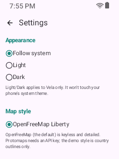
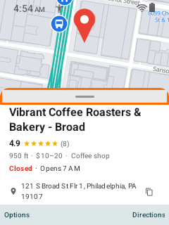
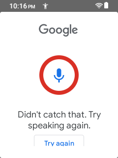
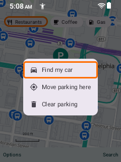

# Kyocera e4810 - restricted flavor findings (240x320 @ 160dpi)

`VELA_PKG=app.vela.restricted.debug bash tests/devices/full_coverage.sh kyocera-e4810` ->
**20 COVERED, 0 MISSED / FULLY COVERED.** All 20 frames are in
[`screenshots/full-restricted/`](screenshots/full-restricted/); the key evidence is embedded below.

## The five locks, shown

**Settings has no Place pages section** (Show reviews / read-all-reviews / Load photos are gone):

**Place sheet: no photos / reviews / Website pill:**

## Voice search stays available (by design - NOT a lock)

The mic is present in the search bar; voice capture opens the system recognizer. The earlier
voice-capture MISS was a harness poll that only matched pre-listening strings and missed the
silence-result state, not an app fault:

## Parking works end to end

Save -> hub (Find my car focused) -> Parked-car sheet:

Both restricted geometries are FULLY COVERED 20/20 (see
[`../sonim-x320/findings-restricted.md`](../sonim-x320/findings-restricted.md) for 480x854).
