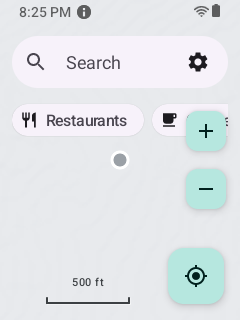
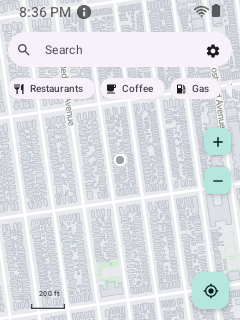
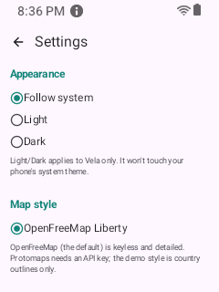
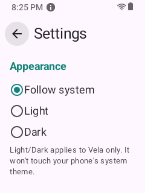
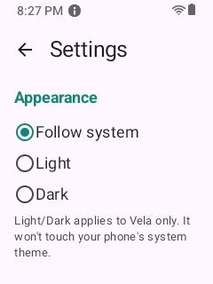
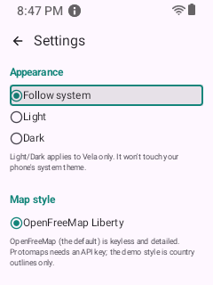

# Kyocera e4810 - findings

- **Screen:** 2.6", 240x320 portrait, ~154 dpi.
- **Emulate:** `adb shell wm size 240x320; adb shell wm density 160`
- **Auditor:** default (`bash tests/small_screen/audit_smallscreen.sh`).

## Status: IN PROGRESS

### Works
- **Adaptive density fits the UI.** With `AdaptiveDensity` (the app scales its own density on small
  screens so it always has >= ~360dp of logical width), the bare map now shows ALL THREE category
  chips (Restaurants/Coffee/Gas) and the full chrome comfortably - before, only "Restaurants" + a
  sliver of Coffee fit. Before:  After:
  . Settings shows more per screen too:
  
- **Settings opens FOCUSED.** The Back button takes focus on open (the robust `dpadAutoFocus`
  fix) - no wasted first keypress. 

### Fixed
- **DOWN from the focused Back button used to CLEAR focus** instead of entering the content list
  (Compose can't cross from the TopAppBar into the scrolling Column and cleared). Fixed with an
  explicit DOWN-from-Back -> first-content-row bridge (`topRowFocus.requestFocus()`, mirror of the
  UP-from-top -> Back routing). Before: 
  After:  - DOWN now lands on "Follow system", next
  DOWN on "Light". Settings is fully D-pad navigable at 240x320.

### Auditor status (240x320)
`tests/small_screen/audit_smallscreen.sh` (warm): bare map / search overlay / place sheet / Settings
all PASS (every element focusable + on-screen). Needed two auditor fixes too: `ui_dump` retries the
uiautomator dump when it races an animation (returned 1 node), and `open_settings` reaches the gear
robustly (RIGHT twice) so the nav isn't flaky. Cold-start (right after install) can still flake the
first surface until the app warms - a warm-up is the remaining auditor hardening.

### Not yet tested (as a real user, at 240x320)
- First-run flow: Welcome, voice/offline prompts, the "Help improve Vela?" diagnostics consent.
- Search overlay + results, place sheet, directions, nav, dialogs/menus.

## Screenshots
See `screenshots/` - all captured at 240x320 via `adb exec-out screencap`.
