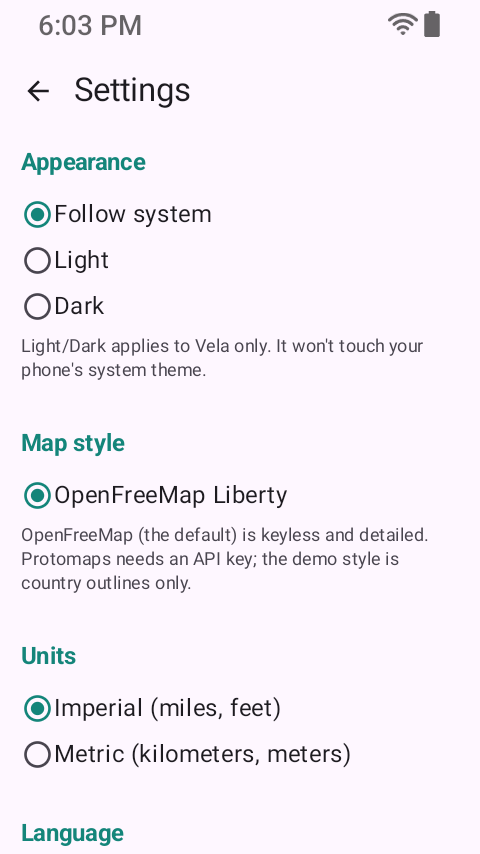
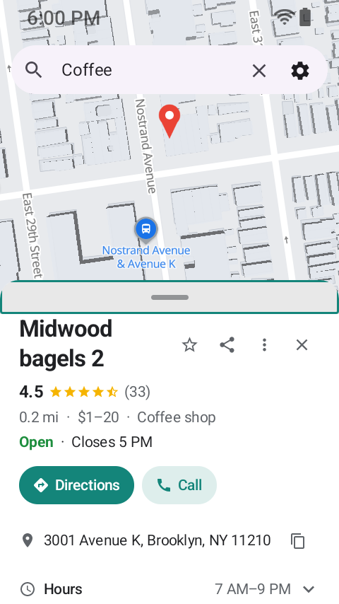
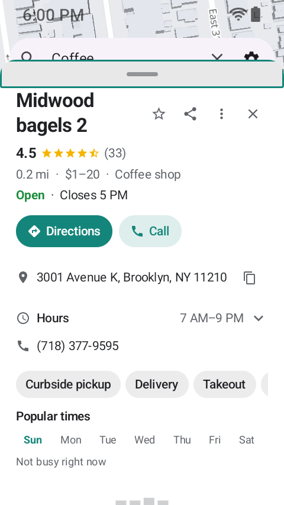
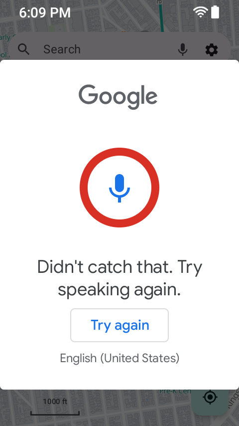
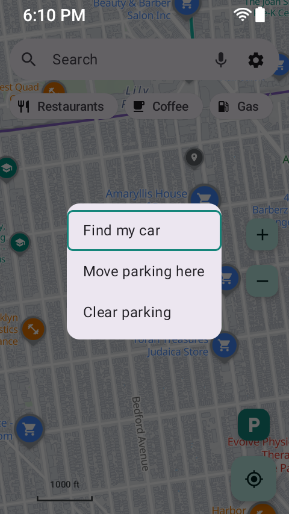

# Sonim X320 - restricted flavor findings (480x854 @ 320dpi)

`VELA_PKG=app.vela.restricted.debug bash tests/devices/full_coverage.sh sonim-x320` ->
**20 COVERED, 0 MISSED / FULLY COVERED.** All 20 frames are in
[`screenshots/full-restricted/`](screenshots/full-restricted/); the key evidence is embedded below.

## The five locks, shown

**Settings has no Place pages section** (Show reviews / read-all-reviews / Load photos are gone):

**Place sheet: no photo hero, Directions + Call only (no Website pill)** - external links + photos locked:

**Expanded place sheet: no reviews section** (goes straight to hours / phone / amenities / popular times):

## Voice search stays available (by design - NOT a lock)

The mic is present in the search bar and voice capture opens the system recognizer:

## Parking works end to end

Save -> hub (Find my car focused with a D-pad ring) -> Parked-car sheet:

Both restricted geometries are FULLY COVERED 20/20 (see
[`../kyocera-e4810/findings-restricted.md`](../kyocera-e4810/findings-restricted.md) for 240x320).
