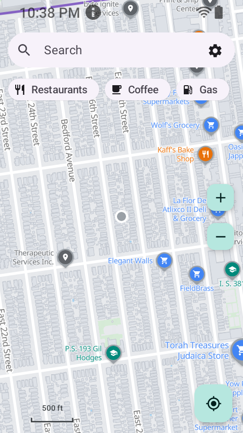
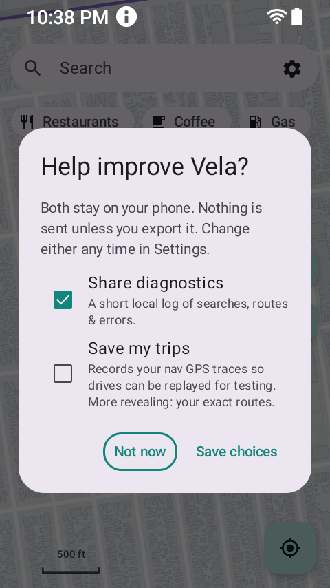
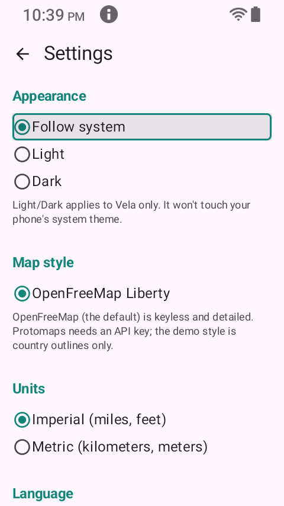

# Sonim X320 (XP3 Plus 5G) - findings

- **Screen:** 2.95" internal TFT, 480x854 PORTRAIT, ~332 dpi (external 1.77" cover display not used
  by the app). Rugged flip phone.
- **Note:** higher resolution than the other targets, but at ~320 density its LOGICAL width is only
  ~240dp - so it's the same UX class, and `AdaptiveDensity` scales it up to ~360dp like the others.
- **Emulate:** `adb shell wm size 480x854; adb shell wm density 320`
- **Auditor:** `VELA_SMALL=480x854 VELA_SMALL_DPI=320 bash tests/small_screen/audit_smallscreen.sh`
  (the clipping check works in physical px, so it must run at the real 480x854 geometry).

## Status: VERIFIED VISUALLY (480x854 @ 320dpi)

Driven at the device's ACTUAL resolution (`wm size 480x854; wm density 320`), which is a different
pixel resolution from the other targets but the same ~240dp logical width - so it's the generality
test for `AdaptiveDensity`, and it passes identically:

- **Bare map** - all three category chips + full chrome fit (adaptive density scaled 240dp -> ~360dp).
  
- **Diagnostics consent dialog** (the tallest) - fits, both checkboxes + descriptions + both buttons
  on-screen, "Not now" focused. 
- **Settings** - opens focused on Back; DOWN enters the content (ring on "Follow system"); the tall
  screen shows Appearance/Map style/Units/Language at once.
  

Confirms AdaptiveDensity works on logical dp, not pixels - so it generalizes across resolutions.
